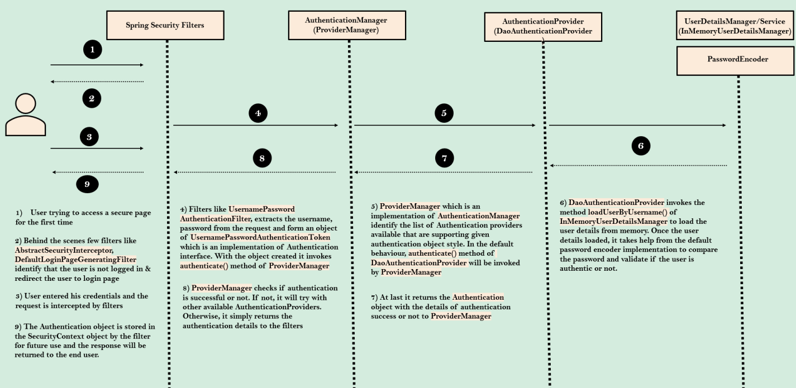

# Spring Security 6 step by step

## Spring Security Basics
### 为什么使用Spring Security
1. Spring Security由Spring的一个团队构建，该团队擅长安全性，并考虑了所有安全场景。使用SpringSecurity，我们可以用最少的配置保护web应用。所以这里没有必要重新发明轮子。
2. Spring Security处理常见的安全漏洞，如CSRE、COR等。对于发现的任何安全漏洞，框架将在许多组织使用时立即修补
3. 使用SpringSecurity，我们可以以最少的配置轻松地保护页面/API路径、强制角色、方法级安全等。同时Spring Security支持各种安全标准来实现身份验证，例如使用用户名/密码身份验证、JWT令牌、OAuthe、OpenID等。
### Spring Security artificture
1. Servlet Container:HTTPRequests和Java代码之间的中间件。将HTTP请求转换成ServletRequest
2. Filters
### Spring Security Core Objects(Components)
1. Authentication
2. AuthenticaitonManager
3. AuthenticationProvider
4. UserDetailsManager/UserDetailsService
5. PasswordEncoder
6. SecurityContext
### Authentication Flow

## Pre-requisite for run projects in this repository

- Good understanding on Java and Spring concepts
- Basic understanding on SpringBoot & REST services is a bonus but not mandatory
- Interest to learn and explore about Spring Security

# Important Links

- Spring website to generate projects - https://start.spring.io/
- Spring boot Common Application Properties - https://docs.spring.io/spring-boot/docs/current/reference/html/application-properties.html#appendix.application-properties

## Important Spring security properties
|  Name   | Description  |
|  ----  | ----  |
| spring.security.user.name  | Default user name |
| spring.security.user.password  | Password for the default user name |

